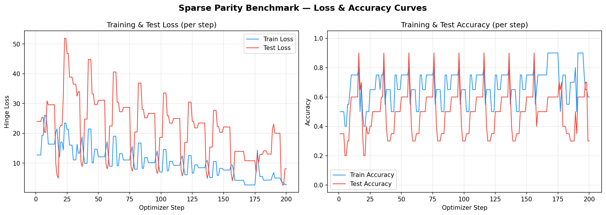

# sutro

**Sparse Parity Benchmark** — an energy-efficiency testbed for neural network learning algorithms.

The [k-sparse parity problem](https://en.wikipedia.org/wiki/Parity_function) is the "Drosophila" of algorithmic benchmarking: simple enough to be tractable, rich enough to exhibit **grokking** (delayed generalization after memorization). The goal is to measure and minimize the *energy cost* — optimizer steps to 100% test accuracy — of different learning algorithms.

## Features

- **Pure Python** — no PyTorch, no NumPy; only `math`, `random`, `time`, and `matplotlib`
- **Manual forward/backward** — all gradients computed by hand; fully transparent
- **Fused layer-wise updates** — SGD update applied immediately after each layer's gradient, reducing memory reuse distance
- **Memory reuse distance tracking** — measures how cache-friendly the algorithm is (clock counts floats, not ops)
- **Modular optimizer** — swap in any learning algorithm at the marked injection point

## Architecture

```
x ∈ {-1,1}^n  →  Linear(W1, b1)  →  ReLU  →  Linear(W2, b2)  →  scalar f(x)
Loss: Hinge loss = max(0, 1 - f(x)·y)
Optimizer: SGD with weight decay (fused into backward pass)
```

## Usage

```bash
python sparse_parity_benchmark.py
```

No installation needed beyond Python 3 and `matplotlib` (auto-installed if missing).

## Sample Output

```
[STEP    1] epoch=1  train_loss=103.8993  test_loss=64.8248  train_acc=60%  test_acc=75%
[STEP   20] epoch=1  train_loss=11.9400   test_loss=28.7414  train_acc=90%  test_acc=70%
[STEP   40] epoch=2  train_loss=0.0000    test_loss=0.0000   train_acc=100% test_acc=100%
  🎉 GENERALIZED at epoch 2! (40 steps, 2.2s)

⚡ ENERGY COST = 2 epochs (40 optimizer steps)
```

## Memory Reuse Distance

The benchmark instruments the first optimizer step to measure *memory reuse distance*: the number of **floats** that flow through memory between when a buffer is written and when it is next read. The clock advances by buffer size, so a 3,000-float matrix contributes 3,000 to the distance while a scalar contributes 1 — matching real cache eviction behavior.

**Small distance → still in cache → energy efficient. Large distance → cache miss → expensive.**

### Per-buffer summary (fused layer-wise updates)

```
Buffer            Size  Reads    Avg Dist       Min       Max  Cache?
────────────  ────────  ─────  ──────────  ────────  ────────  ──────
x                    3      2      10,011         4    20,018       ❌
W1               3,000      2      15,015     5,008    25,022       ❌
b1               1,000      2      17,015     5,008    29,022       ❌
h_pre            1,000      2       7,006     1,000    13,011       ✅
h                1,000      2       2,003     1,000     3,006       ✅
W2               1,000      3      12,013     9,008    15,016       ❌
b2                   1      2      12,512     9,008    16,017       ❌
out                  1      1           1         1         1       ✅
y                    1      1       9,007     9,007     9,007       ✅
dout                 1      2       1,502         1     3,003       ✅
dW2              1,000      1       3,002     3,002     3,002       ✅
db2                  1      1       5,002     5,002     5,002       ✅
dh               1,000      1       4,003     4,003     4,003       ✅
dh_pre           1,000      2       4,502     1,000     8,003       ✅

Average reuse distance (per-read):        8,174 floats
Average reuse distance (per-float-read):  10,219 floats
Total working set:                        10,008 floats
```

### Fused updates vs standard backprop

The key optimization: update each layer's parameters **immediately** after computing its gradient, instead of computing all gradients first and updating at the end.

| Buffer | Standard | Fused | Improvement |
|---|---|---|---|
| `dW2` (1,000 floats) | 16,005 ❌ | **3,002 ✅** | 5.3× closer |
| `db2` (1 float) | 18,005 ❌ | **5,002 ✅** | 3.6× closer |
| Per-read average | 9,716 | **8,174** | 16% reduction |

Gradient buffers `dW2`, `db2` flipped from ❌ to ✅ — consumed while still in cache. For deeper networks, this compounds across more layers.

## Loss & Accuracy Curves



## GPU Toy Problem (Modal)

`gpu_toy.py` runs a matrix-multiply benchmark on a cloud **NVIDIA L4 GPU** via [Modal](https://modal.com), with cost tracking.

### Setup

```bash
uv init && uv add modal     # install modal
uv run python -m modal setup # authenticate (opens browser)
```

### Run

```bash
uv run modal run gpu_toy.py
```

### Sample Output

```
NVIDIA L4  |  23034 MiB  |  CUDA 13.0

PyTorch sees: NVIDIA L4
100 matmuls (4096×4096) in 1.127s  (12.20 TFLOPS)

=======================================================
  GPU TFLOPS:          12.20
  GPU compute time:    1.127s
  Container time:      1.9s
  Total wall time:     12.6s  (incl. startup)
  Estimated cost:      $0.0030  (L4 @ $0.84/hr)
=======================================================
```

