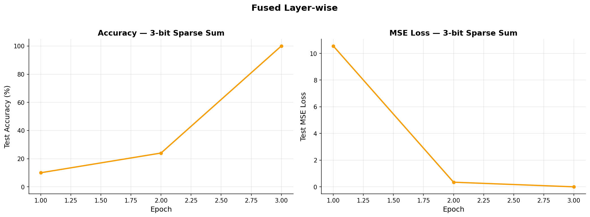
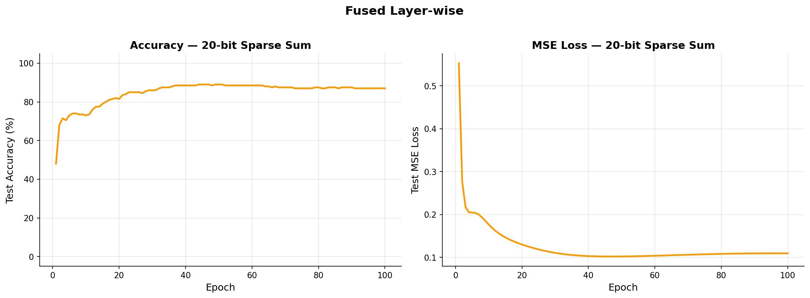

# Sparse Sum: Fused Layer-wise Updates

**Date**: 2026-03-12
**Status**: SUCCESS (3-bit), PARTIAL (20-bit)
**Method**: Fused layer-wise gradient computation + immediate update

## Hypothesis

If we compute each layer's gradients and immediately update that layer's weights (rather than computing all gradients first), the gradient buffers are consumed sooner after being produced. This should reduce ARD because the data is still in cache when it is read.

## Config

| Parameter | 3-bit | 20-bit |
|-----------|-------|--------|
| n_bits | 3 | 20 |
| k_sparse | 3 | 3 |
| hidden | 100 | 200 |
| lr | 0.01 | 0.003 |
| wd | 0.001 | 0.001 |
| n_train | 50 | 200 |
| n_test | 50 | 200 |
| max_epochs | 50 | 100 |

## Results

| Config | Best Accuracy | Final MSE | Weighted ARD | ARD vs Standard | Time |
|--------|:---:|:---:|---:|:---:|---:|
| 3-bit | 100% | 0.0024 | 1,029 | -3.9% | 0.065s |
| 20-bit | 89% | 0.1094 | 7,116 | -1.3% | 41.9s |

## Accuracy Over Time

### 3-bit

### 20-bit

## Analysis

### What worked

- ARD reduced by 3.9% on 3-bit and 1.3% on 20-bit compared to standard backprop.
- Convergence is identical to standard — fusing does not change the mathematical gradients, only the order of weight updates within a single step.
- Slightly faster wall time on both configs (0.065s vs 0.069s on 3-bit).

### What didn't work

- The 1.3% ARD improvement on 20-bit is marginal. The W1 tensor (200 × 20 = 4,000 floats) dominates the reuse distance and fusing cannot change W1's access pattern.
- This is consistent with sparse parity findings where fused layer-wise achieved only 1.3% ARD improvement on 20-bit.

### Comparison with Per-Layer

Fused updates are mathematically equivalent to standard backprop (same gradients, just fused update). Per-layer forward-backward goes further by updating W1 before computing the Layer 2 forward pass, which changes the gradients but achieves better ARD (9.1% vs 3.9% on 3-bit).

## Open Questions

- At what hidden size does the fused advantage become significant?
- Would fusing help more with batch training (batch_size > 1)?

## Files

- Training: `src/sparse_sum/train_fused.py`
- Runner: `src/sparse_sum/run.py`
- Results: `results/sparse_sum/`
