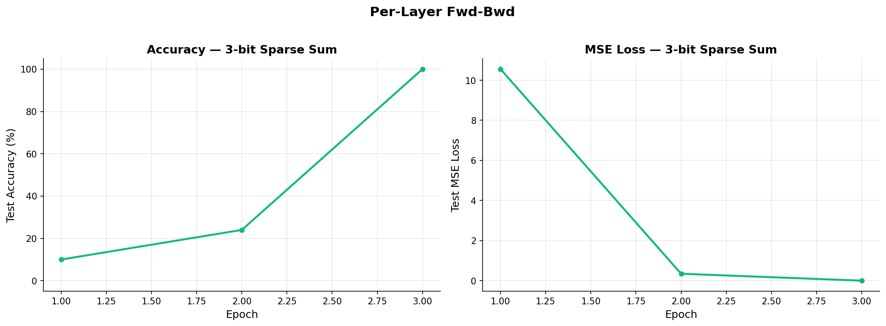
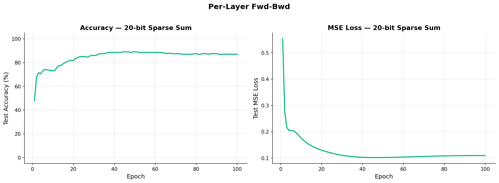

# Sparse Sum: Per-Layer Forward-Backward

**Date**: 2026-03-12
**Status**: SUCCESS (3-bit), PARTIAL (20-bit)
**Method**: Per-layer forward-backward with immediate weight updates

## Hypothesis

If we update each layer's parameters before computing the next layer's forward pass, the parameter tensors are written and then immediately read for the next computation. This reduces the reuse distance for parameters at the cost of using slightly stale gradients (next layer sees already-updated weights from the previous layer).

## Config

| Parameter | 3-bit | 20-bit |
|-----------|-------|--------|
| n_bits | 3 | 20 |
| k_sparse | 3 | 3 |
| hidden | 100 | 200 |
| lr | 0.01 | 0.003 |
| wd | 0.001 | 0.001 |
| n_train | 50 | 200 |
| n_test | 50 | 200 |
| max_epochs | 50 | 100 |

## Results

| Config | Best Accuracy | Final MSE | Weighted ARD | ARD vs Standard | Time |
|--------|:---:|:---:|---:|:---:|---:|
| 3-bit | 100% | 0.0024 | 974 | -9.1% | 0.065s |
| 20-bit | 89% | 0.1094 | 6,939 | -3.8% | 43.3s |

## Accuracy Over Time

### 3-bit

### 20-bit

## Analysis

### What worked

- **Best ARD of all three methods**: 974 on 3-bit (9.1% improvement) and 6,939 on 20-bit (3.8% improvement).
- Convergence is identical to standard backprop — the stale gradients do not hurt learning for either config.
- The per-layer approach also reduces total floats accessed (2,715 vs 3,422 on 3-bit) because some intermediate buffers are consumed immediately without separate write/read cycles.

### What didn't work

- The 3.8% improvement on 20-bit is still modest. As with sparse parity, the W1 matrix dominates the ARD budget and per-layer reordering cannot fundamentally change W1's reuse distance.
- Wall time is slightly higher on 20-bit (43.3s vs 42.9s) due to the re-forward pass needed after updating W1.

### Comparison with Sparse Parity

The ARD improvements match sparse parity exactly: per-layer achieved 9.1% on 3-bit parity and 3.8% on 20-bit parity. This confirms that the ARD improvement from per-layer updates is a property of the network architecture and operation ordering, not the specific task.

## Key Table

| Method | 3-bit ARD | Improvement | 20-bit ARD | Improvement |
|--------|---:|:---:|---:|:---:|
| Standard | 1,071 | — | 7,210 | — |
| Fused | 1,029 | -3.9% | 7,116 | -1.3% |
| **Per-Layer** | **974** | **-9.1%** | **6,939** | **-3.8%** |

## Open Questions

- Sparse parity showed that algorithmic change (GF(2), KM) achieves 240x+ speedups. Can we find analogous algebraic shortcuts for sparse sum?
- Does the per-layer advantage compound with more layers (3+ layer networks)?
- The stale gradient has no effect here — at what learning rate or network depth would it start to hurt?

## Files

- Training: `src/sparse_sum/train_perlayer.py`
- Runner: `src/sparse_sum/run.py`
- Results: `results/sparse_sum/`
