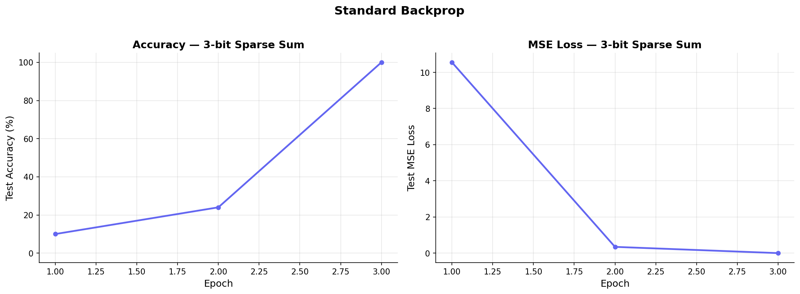
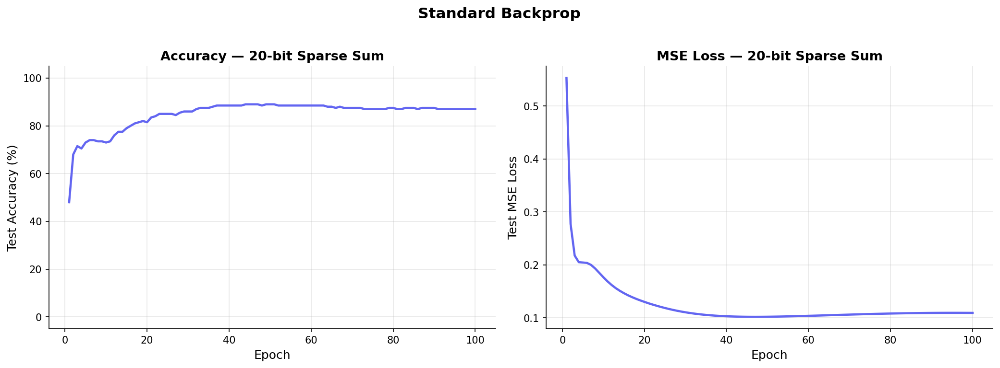

# Sparse Sum: Standard Backprop

**Date**: 2026-03-12
**Status**: SUCCESS (3-bit), PARTIAL (20-bit)
**Method**: Standard SGD with MSE loss

## Hypothesis

Standard backpropagation with MSE loss serves as the baseline for sparse sum. All gradients are computed first, then all parameters are updated. This establishes the reference ARD and accuracy for comparison with fused and per-layer variants.

## Config

| Parameter | 3-bit | 20-bit |
|-----------|-------|--------|
| n_bits | 3 | 20 |
| k_sparse | 3 | 3 |
| hidden | 100 | 200 |
| lr | 0.01 | 0.003 |
| wd | 0.001 | 0.001 |
| n_train | 50 | 200 |
| n_test | 50 | 200 |
| max_epochs | 50 | 100 |

## Results

| Config | Best Accuracy | Final MSE | Weighted ARD | Total Floats | Time |
|--------|:---:|:---:|---:|---:|---:|
| 3-bit | 100% | 0.0024 | 1,071 | 3,422 | 0.069s |
| 20-bit | 89% | 0.1094 | 7,210 | 14,622 | 42.9s |

## Accuracy Over Time

### 3-bit

### 20-bit

## Analysis

### What worked

- 3-bit converges to 100% accuracy in 3 epochs. The task is trivial when all bits participate.
- 20-bit reaches 89% accuracy by epoch 12 and plateaus. The model learns to identify the 3 secret bits among 20.

### What didn't work

- 20-bit does not reach 100%. The regression target (predicting the exact sum) is harder than the binary classification in sparse parity.
- Overfitting visible: test loss rises after epoch 45 while training loss continues to decrease.

## Open Questions

- Would larger n_train (e.g., 500 or 1000) push 20-bit past 90%?
- How does the sparse sum ARD compare to sparse parity at the same config?
- Is the regression difficulty fundamental, or would a different loss (Huber, quantile) help?

## Files

- Training: `src/sparse_sum/train.py`
- Runner: `src/sparse_sum/run.py`
- Results: `results/sparse_sum/`
