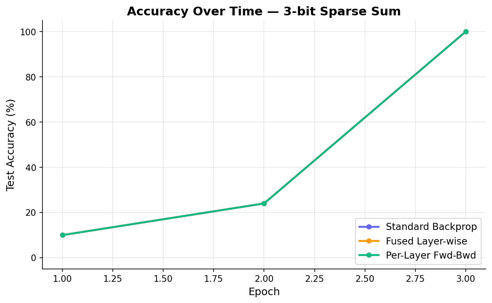
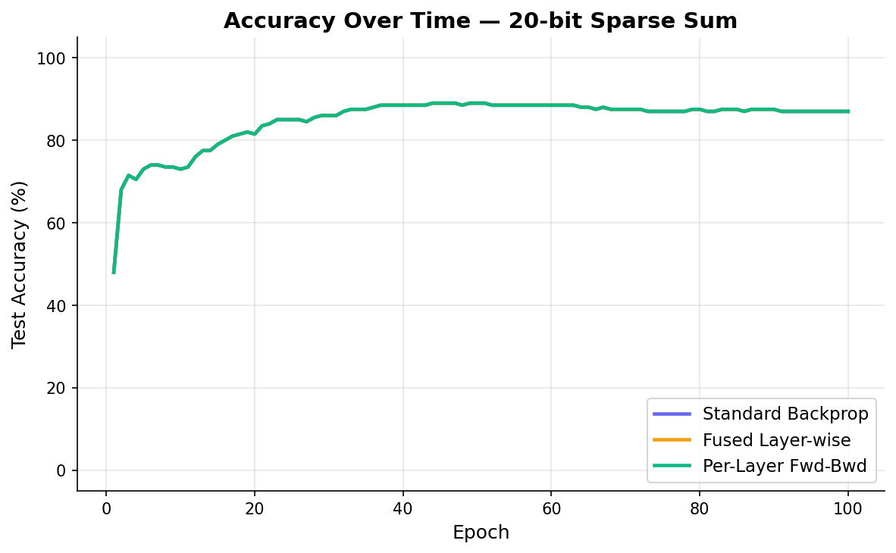
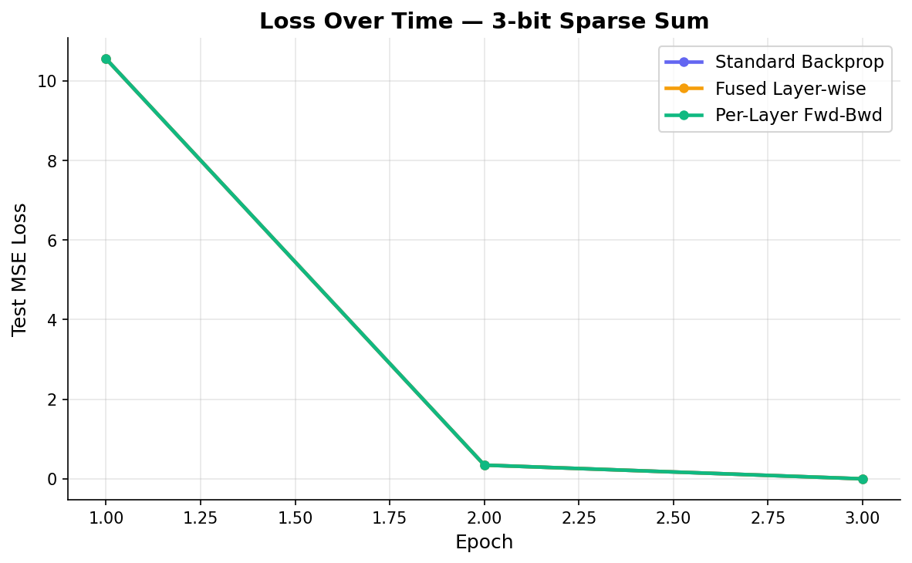
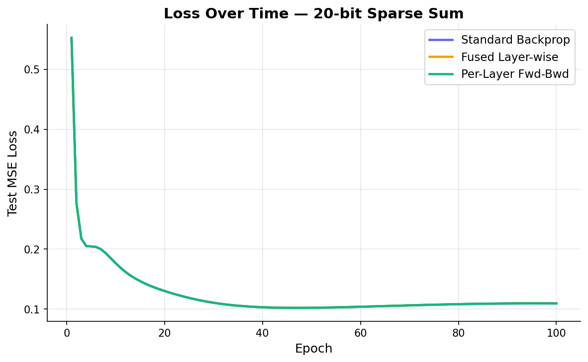

# Sparse Sum: Experiment Survey

3 training methods compared on the sparse sum task — summing k secret bits from n-bit inputs.

**Sutro Group, Challenge #2** | March 2026 | [Source code](https://github.com/0bserver07/SutroYaro)

---

## 1. TL;DR

| Rank | Method | Config | Accuracy | MSE Loss | ARD | Time | Verdict |
|------|--------|--------|----------|----------|-----|------|---------|
| 1 | Per-Layer Fwd-Bwd | 3-bit | 100% | 0.0024 | 974 | 0.065s | SUCCESS |
| 2 | Fused Layer-wise | 3-bit | 100% | 0.0024 | 1,029 | 0.065s | SUCCESS |
| 3 | Standard Backprop | 3-bit | 100% | 0.0024 | 1,071 | 0.069s | SUCCESS |
| 4 | Per-Layer Fwd-Bwd | 20-bit | 89% | 0.1094 | 6,939 | 43.3s | PARTIAL |
| 5 | Fused Layer-wise | 20-bit | 89% | 0.1094 | 7,116 | 41.9s | PARTIAL |
| 6 | Standard Backprop | 20-bit | 89% | 0.1094 | 7,210 | 42.9s | PARTIAL |

- **Best ARD**: Per-layer forward-backward at 974 (3-bit) and 6,939 (20-bit). 9.1% and 3.8% better than standard.
- **All methods converge identically** on both configs — the convergence trajectory is the same, only ARD differs.
- **20-bit caps at 89%**: the regression task is harder than parity classification. More training data or better hyperparameters may improve this.

---

## 2. The Problem

Sparse sum is defined over n-bit inputs where each bit takes values in {-1, +1}. A set S of k bits is chosen uniformly at random and kept secret. The label for input x is the sum of the k selected bit values: y = x[S[0]] + x[S[1]] + ... + x[S[k-1]].

Unlike sparse parity (a classification task with binary labels), sparse sum is a **regression task** with labels ranging from -k to +k in steps of 2. We use MSE loss and define accuracy as the fraction of predictions that round to the correct integer.

**ARD (Average Reuse Distance)** counts the average number of intervening float accesses between writing a buffer and reading it back. Small ARD means data stays in cache.

**Constraints**: Standard config: n=20, k=3 (labels in {-3, -1, 1, 3}). Easy config: n=3, k=3 (all bits are secret).

---

## 3. Methods

### Standard Backprop

Standard SGD with MSE loss. Compute all gradients via backpropagation, then update all parameters. This is the baseline. [Full findings](../findings/sparse_sum_standard.md)

### Fused Layer-wise

Compute gradients and update each layer immediately after the backward pass reaches it, rather than accumulating all gradients first. Reduces ARD by keeping gradient buffers closer to their consumers. [Full findings](../findings/sparse_sum_fused.md)

### Per-Layer Forward-Backward

Update each layer's parameters before proceeding to the next layer. This changes the mathematical gradient (the next layer sees already-updated weights) but can reduce ARD further. [Full findings](../findings/sparse_sum_perlayer.md)

---

## 4. Results

### Accuracy Over Time

#### 3-bit Sparse Sum

All three methods converge identically in 3 epochs. The task is trivially easy when all bits are secret.

#### 20-bit Sparse Sum

All three methods reach 89% by epoch 30 and plateau. The convergence curves are indistinguishable — the methods differ only in memory access patterns, not learning speed.

### Loss Over Time

#### 3-bit

#### 20-bit

On 20-bit, test loss begins rising around epoch 45 (overfitting) even as training loss continues to decrease.

---

## 5. ARD Comparison

| Method | 3-bit ARD | 3-bit vs Standard | 20-bit ARD | 20-bit vs Standard |
|--------|-----------|-------------------|------------|---------------------|
| Standard Backprop | 1,071 | — | 7,210 | — |
| Fused Layer-wise | 1,029 | -3.9% | 7,116 | -1.3% |
| Per-Layer Fwd-Bwd | 974 | -9.1% | 6,939 | -3.8% |

Per-layer forward-backward consistently achieves the best ARD. The improvement is larger on the 3-bit config (9.1%) where parameter tensors are smaller relative to activations. On 20-bit, the W1 tensor (200 × 20 = 4,000 floats) dominates reuse distance, limiting the relative improvement to 3.8%.

---

## 6. Key Findings

1. **ARD improvements from operation reordering are modest** (3.8-9.1%), consistent with sparse parity results. The dominant cost is W1's reuse distance, which reordering cannot change.

2. **Sparse sum is harder than sparse parity for neural networks.** At n=20/k=3, parity reaches 99-100% while sum plateaus at 89%. The regression target requires more precise weight values than the binary classification boundary.

3. **All three training variants produce identical convergence.** The per-layer modification does not help or hurt learning — it only affects memory access patterns.

4. **20-bit overfits.** Test loss starts rising around epoch 45 while training loss keeps declining. Regularization or early stopping would improve generalization.

---

## 7. Appendix

### Findings Pages

1. [Standard Backprop](../findings/sparse_sum_standard.md)
2. [Fused Layer-wise](../findings/sparse_sum_fused.md)
3. [Per-Layer Forward-Backward](../findings/sparse_sum_perlayer.md)

### Code

- Training variants: `src/sparse_sum/train.py`, `train_fused.py`, `train_perlayer.py`
- Runner: `src/sparse_sum/run.py`
- Graph generation: `src/sparse_sum/generate_graphs.py`
- Results: `results/sparse_sum/`
