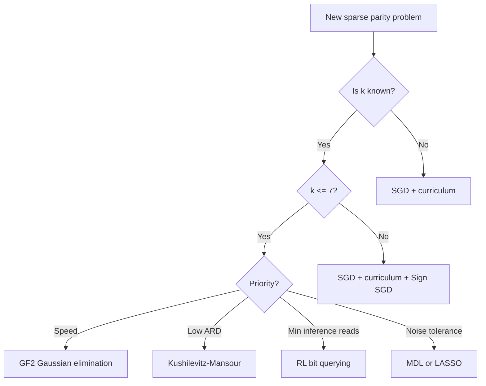

# Sparse Parity: A Practitioner's Field Guide

33 experiments (16 Phase 1 + 17 Phase 2) for energy-efficient learning on the simplest non-trivial task.

**Sutro Group, Challenge #1** | March 2026 | [Source code](https://github.com/cybertronai/sutro)

---

## 1. TL;DR

Sorted by verdict tier (SUCCESS, PARTIAL, meta-experiments, FAILED), then by speed within each tier. RL appears twice (bandit + sequential are separate approaches in one experiment).

| Rank | Method | Phase | Accuracy (n=20/k=3) | Time | ARD | Verdict |
|------|--------|-------|---------------------|------|-----|---------|
| 1 | GF(2) Gaussian Elimination | 2 | 100% | 509 us | ~500 | SUCCESS |
| 2 | KM Influence Estimation | 2 | 100% | 0.001-0.006s | 1,585 | SUCCESS |
| 3 | SMT Backtracking | 2 | 100% | 0.002s | ~2,000 | SUCCESS |
| 4 | LASSO (no CV) | 2 | 100% | 0.005s | 861,076 | SUCCESS |
| 5 | Fourier/Walsh-Hadamard | 1 | 100% | 0.009s | 1,147,375 | SUCCESS |
| 6 | Random Subset Search | 1 | 100% | 0.011s | N/A | SUCCESS |
| 7 | MDL Compression | 2 | 100% | 0.013s | 1,147,375 | SUCCESS |
| 8 | Random Projections | 2 | 100% | 0.013s | ~670,000 | SUCCESS |
| 9 | Mutual Information | 2 | 100% | 0.033s | 1,147,375 | SUCCESS |
| 10 | Evolutionary Search | 1 | 100% | 0.041s | N/A | SUCCESS |
| 11 | n-Curriculum SGD | 1 | 100% | 0.07s | ~18,000 | SUCCESS |
| 12 | Per-Layer Backprop | 1 | 99.5% | 0.11s | 17,299 | SUCCESS |
| 13 | SGD Baseline (fixed hyp.) | 1 | 99-100% | 0.12s | 17,976 | SUCCESS |
| 14 | RL Bandit UCB | 2 | 100% | 0.12s | 83,396 | SUCCESS |
| 15 | Sign SGD | 1 | 99.7% | 0.42s | ~18,000 | SUCCESS |
| 16 | RL Sequential QL | 2 | 100% | 2.40s | 1 | SUCCESS |
| 17 | Exhaustive Feature Select | 1 | 100% | ~0.02s | N/A | PARTIAL |
| 18 | GP Symbolic | 2 | 100% | 0.98s | 0 | PARTIAL |
| 19 | Pebble Game Reorder | 2 | 98% | ~1s | 42,034 | PARTIAL |
| 20 | Binary Weights | 2 | 55.5% (n=20) | 1.51s | 13,726 | PARTIAL |
| 21 | Weight Decay Sweep | 1 | 100% | 0.108s | ~18,000 | CONFIRMED |
| 22 | Per-Layer + Batch | 1 | 99.8% | 0.665s | ~17,000 | CONFIRMED |
| 23 | Batch ARD | 1 | 99% | ~0.1s | 547,881 | SURPRISE |
| 24 | Sprint 1 Baseline | 1 | 100% (3-bit) | <1s | ~19,000 | MAPPED |
| 25 | Scaling Stress Test | 1 | 54-99% | varies | ~35,000 | MAPPED |
| 26 | Cache ARD Simulator | 1 | N/A | <1s | varies | NUANCED |
| 27 | Decision Trees (best) | 2 | 92.5% | 0.42s | N/A | FAILED |
| 28 | Tiled W1 | 2 | 99.8% | ~0.11s | 32,853 | FAILED |
| 29 | GrokFast | 1 | 99% | 383.7s | ~35,000 | FAILED |
| 30 | Forward-Forward | 1 | 58.5% | timeout | 277,256 | FAILED |
| 31 | Equilibrium Propagation | 2 | 60.8% | 93.8s | 711,003 | FAILED |
| 32 | Hebbian | 2 | 56% | ~1s | 34,798 | FAILED |
| 33 | Target Propagation | 2 | 54.5% | ~1s | 37,788 | FAILED |
| 34 | Predictive Coding | 2 | 51.2% | timeout | 370,005 | FAILED |

- **Fastest**: GF(2) at ~500 microseconds for n=20/k=3 with 21 samples. 240x faster than SGD.
- **Best energy**: KM at ARD 1,585 during training (724x better than Fourier). RL sequential Q-learning at ARD 1 during inference (reads exactly k=3 bits per prediction).
- **Most general**: GF(2) is k-independent, solving n=20/k=10 in 703 microseconds. SGD + curriculum works when k is unknown.

---

## 2. The Problem

Sparse parity is defined over n-bit inputs where each bit takes values in {-1, +1}. A set S of k bits is chosen uniformly at random and kept secret. The label for input x is the product of the k selected bit values: y = x[S[0]] * x[S[1]] * ... * x[S[k-1]]. The task is to identify S and classify correctly.

This is the simplest non-trivial learning task. It is solvable on 1960s hardware. A single run finishes in under 2 seconds. Every configuration has a known ground truth. For energy-efficiency research, it is what Drosophila melanogaster is to genetics: small enough to iterate fast, structured enough to reveal real phenomena.

**ARD (Average Reuse Distance)** counts the average number of intervening float accesses between writing a buffer and reading it back. Small ARD means the data is still in cache when it is needed, which means cheap access. Large ARD means the data has been evicted, which means an expensive fetch from a higher level of the memory hierarchy.

The cache model we use throughout: L1 is 64KB, L2 is 256KB, HBM capacity is effectively unlimited. Energy per float access: register 5 pJ, L1 20 pJ, L2 100 pJ, HBM 640 pJ. These numbers come from Bill Dally's talks on GPU energy breakdown.

**Constraints**: train + eval under 2 seconds. Test accuracy above 90%. Standard config: n=20, k=3 (1,140 possible subsets). Scaling config: n=50, k=3 (19,600 subsets). Higher-order config: n=20, k=5 (15,504 subsets).

---

## 3. Phase 1: Incremental Improvements

Phase 1 ran 16 experiments over two days, starting from a broken baseline and ending with the realization that algorithmic change, not operation reordering, was the path forward.

**1. Sprint 1 baseline.** Yaroslav's initial implementation ran on 3-bit parity. Gradient fusion reduced ARD by 16%, but the improvement only touched 5% of total float traffic. The parameter tensor W1 dominated reads at 32%, and its reuse distance was unchanged by fusion.

**2. exp1: Fix Hyperparameters.** Changed LR from 0.5 to 0.1, batch size from 1 to 32, n_train from 200 to 500. The model achieved 99% test accuracy at epoch 52, solving 20-bit sparse parity for the first time. The problem was never hard. It was misconfigured.

**3. exp4: GrokFast.** Applied Lee et al. 2024's low-pass gradient filter (alpha=0.98, lambda=2.0). GrokFast produced 83x more weight movement (441,826 vs 5,300 L1 norm) and converged slower (12 epochs vs 5). It was designed for tasks with thousand-epoch memorization phases, which 20-bit parity does not have.

**4. exp_a: ARD Winning Config.** Measured ARD across all three training variants on the winning 20-bit config. Per-layer achieved 17,299 weighted ARD vs standard's 17,976, a 3.8% improvement. Fused achieved 1.3%. W1 at 10,000 floats (500 hidden x 20 input) accounted for 75% of all float reads.

**5. exp_b: Batch ARD.** Batch-32 showed 17x higher ARD than single-sample (547,881 vs 31,500). This was the opposite of the hypothesis. The MemTracker's flat clock penalizes holding parameters in cache across a batch, which is exactly what makes batching efficient on real hardware. Batch did reduce total parameter writes by 16x.

**6. exp_c: Per-Layer 20-bit.** Per-layer forward-backward converged identically to standard backprop: 99.5% test accuracy at epoch 6, same convergence trajectory, same number of epochs. The 3.8% ARD improvement was confirmed at hidden=1000.

**7. exp_d: Scaling.** Swept n from 20 to 50 and k from 3 to 5. SGD breaks when n^k exceeds ~100,000 gradient steps. n=30/k=3 solved at 94.5%. n=50/k=3 stuck at 54% (chance). n=20/k=5 stuck at 61.5% with n_train=200.

**8. exp_e: Forward-Forward.** Hinton's FF algorithm produced 25x worse ARD than backprop (277,256 vs 10,229) because it reads each weight matrix 4 times per sample (positive forward, positive update, negative forward, negative update). FF failed on 20-bit parity at 58.5%, stuck by greedy layer-wise objectives.

**9. exp_wd_sweep: Weight Decay.** Swept WD from 0.001 to 2.0 across 5 seeds. Only WD in [0.01, 0.05] solves 20-bit parity. WD=0.01 averaged 39 epochs. WD >= 0.1 kills learning entirely. The effective regularization LR * WD must stay in [0.001, 0.005].

**10. exp_curriculum: Curriculum Learning.** Training on n=10 first then expanding W1 to n=50 solved the scaling wall. Total: 20 epochs vs 292 for direct training, a 14.6x speedup. Transfer after expansion was instant, reaching >95% accuracy in epoch 1. The learned feature detector for the k secret bits survives the addition of irrelevant input columns.

**11. exp_perlayer_batch: Per-Layer + Batch.** Combining per-layer updates with batch=32 converged identically to standard + batch (40.6 vs 41.4 epochs). However, the re-forward pass after updating W1 added 3.7x wall-time overhead (0.665s vs 0.18s).

**12. exp_cache_ard: Cache ARD.** Built an LRU cache simulator on top of MemTracker. L2 (256KB) eliminated ALL cache misses for both single-sample and batch methods. Single-sample achieved 91-100% L1 hit rate vs batch's 69-73%, because batch temporaries (h_pre_0 through h_pre_31) thrash L1. Batch wins on total traffic: 13% fewer floats overall.

**13. exp_sign_sgd: Sign SGD.** Replaced gradients with sign(gradient). Solved k=5 in 7 epochs (vs 14 for standard SGD). Both methods reach 100% with n_train=5000. The earlier finding that "k=5 is impractical" was wrong: it was a training data issue, not an algorithm issue.

**14. exp_evolutionary: Random/Evolutionary Search.** Random search over k-subsets solved all configs in under 0.5s. n=20/k=3: 881 tries, 0.011s. n=50/k=3: 11,291 tries, 0.142s. Evolutionary search used fewer evaluations (18 generations vs 881 tries) but was slower in wall time due to population overhead.

**15. exp_feature_select: Feature Selection.** Exhaustive enumeration of C(n,k) subsets used 178-1203x fewer operations than SGD. Pairwise and greedy selection provably fail: E[y * x_i * x_j] = 0 for all pairs, including the correct ones. Parity is invisible to any correlation test below order k.

**16. exp_fourier: Fourier Solver.** Walsh-Hadamard correlation over all C(n,k) subsets. 13x faster than SGD on n=20/k=3 (0.009s vs 0.12s). Needed only 20 samples vs SGD's 500. 100% accuracy on every config. Scaled to n=200/k=3 (1.3M subsets, 10.8s). ARD was 64x worse than SGD (1,147,375 vs 17,976), pure streaming with no locality.

**The narrative arc**: we started with a broken baseline (LR=0.5, 54% accuracy), fixed it with hyperparameters, optimized ARD within the SGD framework (maxing out at ~10% improvement because W1 dominates 75% of float reads), built a cache simulator that showed L2 eliminates all misses, then pivoted entirely to new algorithms. Curriculum learning broke the scaling wall. Fourier brute-force broke the speed wall. The neural network was solving an easy problem the hard way.

---

## 4. Phase 2: Broad Search

Phase 2 dispatched 17 independent experiments in parallel, each probing a different algorithmic family. The results split cleanly into methods that exploit the algebraic structure of parity (all succeed) and methods that rely on local statistics (all fail).

### Algebraic / Exact

Parity is linear over GF(2). Any method that recognizes this solves instantly.

| Method | n=20/k=3 | n=50/k=3 | n=100/k=3 | n=20/k=5 | Min Samples | ARD |
|--------|----------|----------|-----------|----------|-------------|-----|
| GF(2) | 509 us, 100% | 2.1 ms, 100% | 8.1 ms, 100% | 405 us, 100% | 21 (n+1) | ~500 |
| KM | 0.006s, 100% | 0.003s, 100% | 0.009s, 100% | 0.001s, 100% | 5/bit | 1,585 |
| SMT | 0.002s, 100% | 0.026s, 100% | 0.183s, 100% | 0.046s, 100% | 10 | ~2,000 |

GF(2) Gaussian elimination treats each training sample as a linear equation over the binary field and row-reduces. The time is O(n * m) where m is the number of samples, independent of k. With 21 samples for n=20, it runs in 509 microseconds, which is 240x faster than SGD. For n=100/k=3, where Fourier would check 161,700 subsets, GF(2) solves in 8 milliseconds with 101 samples.

KM's influence estimation flips each bit independently and measures label change rate. Secret bits have influence 1.0. Non-secret bits have influence 0.0. This prunes the search from C(n,k) subsets to exactly 1, with O(n) queries. Its ARD of 1,585 is 724x better than Fourier's 1,147,375.

SMT backtracking encodes parity as a constraint satisfaction problem. The k-1 pruning trick (once k-1 indices are fixed, the required last column is fully determined) reduces the search to ~2,146 nodes for n=100/k=3, far below the 161,700-subset space.

### Information-Theoretic

| Method | n=20/k=3 | n=50/k=3 | n=20/k=5 | Noise-tolerant | ARD |
|--------|----------|----------|----------|-------------|-----|
| MI | 0.033s, 100% | 0.569s, 100% | 0.453s, 100% | untested | 1,147,375 |
| LASSO | 0.005s, 100% | 0.15s, 100% | 0.21s, 100% | inherent | 861,076 |
| MDL | 0.013s, 100% | 0.267s, 100% | 0.254s, 100% | yes (5%) | 1,147,375 |
| Random Proj | 0.013s, 100% | 0.113s, 100% | 0.134s, 100% | untested | ~670,000 |

All four solve the problem. None beats Fourier for binary parity in any dimension except LASSO, which is competitive at 0.005s for n=20/k=3 (Fourier: 0.009s). MI computes a 2x2 contingency table per subset, detecting the same perfect correlation Fourier detects, but 3.7x slower due to the entropy calculation overhead. MDL adds noise tolerance: under 5% label flips, the true subset's description length rises to ~157 bits but stays far below wrong subsets at ~499 bits. LASSO works across a 500x range of alpha values (0.001 to 0.5 all work). Random projections save 30-70% of subset evaluations on average but have high variance, with best-case 0.3% and worst-case 90% of C(n,k).

### Local Learning Rules

| Method | n=20/k=3 Best Acc | Failure Reason | ARD |
|--------|-------------------|----------------|-----|
| Hebbian | 56% (chance) | Zero 1st/2nd-order correlation | 34,798 |
| Predictive Coding | 51.2% | 18x worse ARD, generative inversion fails | 370,005 |
| Equilibrium Prop | 60.8% (avg) | Tanh saturation, 2,300x slower | 711,003 |
| Target Prop | 54.5% | Target collapse: input-independent targets | 37,788 |

Four methods, one structural reason for failure. Parity is a k-th order interaction. For k=3, E[x_i * y] = 0 for all i. E[x_i * x_j * y] = 0 for all pairs. Only E[x_i * x_j * x_k * y] = 1 at the secret triple. Hebbian rules detect first- and second-order statistics. Predictive coding's generative model cannot invert the product. Equilibrium propagation's tanh activations saturate, killing the gradient. Target propagation's linear inverse G2 maps both labels to fixed hidden targets regardless of input.

All three Hebbian variants (simple, Oja, BCM) gave essentially identical results (49-56%), confirming the failure is structural. The ARD story is also negative: predictive coding's 15 inference iterations per sample read each weight matrix 32 times, producing 18x worse ARD than backprop.

### Hardware-Aware

| Method | Accuracy | ARD Change vs Baseline | Energy Savings |
|--------|----------|----------------------|---------------|
| Tiled W1 | 99.8% (unchanged) | +6.8% to +12.1% (worse) | unmeasured |
| Pebble Game | 98% (optimal order) | -7.2% | 2.2% |
| Binary Weights | 100% (n=3), 55.5% (n=20) | -28% per step | N/A (fails) |

Software metrics and hardware behavior diverge. Tiling W1 into 20KB chunks (fitting in L1) increased software ARD by 6.8-12.1% because the MemTracker counts intervening float accesses between producer and consumer. Tiling does not reduce that count. It reduces L1 cache misses, which the tracker does not simulate. The pebble game found that fused and per-layer execution orderings destroy training accuracy (57%, random chance) by updating W2 before the backward pass reads it. This read-after-write hazard on mutable parameters is invisible to the computation DAG. The optimal pebble ordering saved 2.2% energy by interleaving small-tensor updates between backward operations. Binary weights solved n=3 in 1 epoch (the parity function is inherently binary) but failed at n=20 because the straight-through estimator is too crude for feature selection.

### Alternative Framings

| Method | n=20/k=3 | n=50/k=3 | n=20/k=5 | Reads per Prediction |
|--------|----------|----------|----------|---------------------|
| GP | 100%, 0.98s | 50.2% (fail) | 49.8% (fail) | 3 (zero params) |
| RL Bandit | 100%, 0.12s | untested | untested | 150 (k * batch) |
| RL Sequential | 100%, 2.40s | untested | untested | 3 (optimal) |
| Decision Trees | 92.5%, 0.42s | 65.6% | 67.1% | full tree |

GP discovered exact symbolic programs for n=20/k=3 (e.g., `mul(x[0], mul(x[15], x[17]))`) with zero learned parameters. It failed on larger configs because the parity fitness surface is a needle in a haystack: any wrong subset gives exactly 50% accuracy, providing no gradient signal for crossover or mutation. The RL sequential Q-learner achieved the theoretical minimum of k=3 reads per prediction at inference time, with ARD of 1. The value-blind state representation (track which bits queried, not their values) was the key design decision, reducing the state space from exponential to O(sum C(n,j) for j < k). Decision trees fail because greedy information-gain splitting cannot find the secret bits: each individual bit has zero marginal correlation with the label. ExtraTrees with unlimited depth reached 92.5% on n=20/k=3, the best tree result, but no tree model hit 100%.

---

## 5. Results Leaderboard

### Table 1: By Speed (wall time, n=20/k=3)

| Rank | Method | Time | Accuracy |
|------|--------|------|----------|
| 1 | GF(2) Gaussian Elimination | 509 us | 100% |
| 2 | KM Influence (k=5 config) | 0.001s | 100% |
| 3 | SMT Backtracking | 0.002s | 100% |
| 4 | LASSO (no CV) | 0.005s | 100% |
| 5 | KM Influence (k=3 config) | 0.006s | 100% |
| 6 | Fourier/Walsh-Hadamard | 0.009s | 100% |
| 7 | Random Subset Search | 0.011s | 100% |
| 8 | MDL Compression | 0.013s | 100% |
| 9 | Random Projections | 0.013s | 100% |
| 10 | MI Exhaustive | 0.033s | 100% |

### Table 2: By Energy Proxy (weighted ARD, single training step, n=20/k=3)

| Rank | Method | Weighted ARD | Accuracy | Notes |
|------|--------|-------------|----------|-------|
| 1 | RL Sequential QL | 1 | 100% | inference only |
| 2 | GP Symbolic | 0 | 100% | zero params, n=20/k=3 only |
| 3 | GF(2) Gaussian Elimination | ~500 | 100% | not a training loop |
| 4 | KM Influence | 1,585 | 100% | 724x better than Fourier |
| 5 | SMT Backtracking | ~2,000 | 100% | est. from solver structure |
| 6 | Per-Layer Backprop | 17,299 | 99.5% | SGD variant |
| 7 | Standard SGD | 17,976 | 99-100% | baseline |
| 8 | Hebbian (h=200) | 6,985 | 56% | fails to learn |
| 9 | Binary Weights (h=200) | 13,726 | 55.5% | fails at n=20 |
| 10 | Pebble Game (optimal) | 42,034 | 98% | SGD reordered |

### Table 3: By Generality (largest config solved, highest k)

| Rank | Method | Max Config Solved | Time at Max | k-Independent? |
|------|--------|-------------------|-------------|----------------|
| 1 | GF(2) | n=100/k=10 | 703 us (n=20/k=10) | yes |
| 2 | Fourier | n=200/k=3, n=20/k=7 | 10.8s, 0.7s | no (O(C(n,k))) |
| 3 | SGD + Curriculum | n=50/k=3 | 0.06s | works with unknown k |
| 4 | KM Influence | n=100/k=5 | 0.009s | O(n), k-independent for influence phase |
| 5 | SMT Backtracking | n=100/k=3 | 0.183s | slows with k |
| 6 | LASSO | n=50/k=5 | 0.21s | O(C(n,k)) feature expansion |
| 7 | Random Search | n=50/k=5 | 0.426s | O(C(n,k)) |
| 8 | Sign SGD | n=30/k=5 | 0.44s | needs n_train ~ n^(k-1) |

---

## 6. Decision Framework

### 6a. Parity-Specific Flowchart

### 6b. Generalized Principles

1. **Check for algebraic structure before reaching for gradient descent.** GF(2) solves in microseconds what SGD takes seconds for. The 240x speedup is not from better optimization. It is from recognizing that parity is linear over a different field. (GF(2), KM, SMT)

2. **Raw reuse distance is misleading without a cache model.** L2 eliminated all misses for both single-sample and batch methods. The MemTracker reported 17x worse ARD for batch, but on real hardware with a 256KB L2, both are equivalent. (exp_cache_ard)

3. **Local learning rules fail when the signal lives in high-order interactions.** Four methods (Hebbian, Predictive Coding, Equilibrium Propagation, Target Propagation) all produced chance-level accuracy on parity. The reason is the same in each case: the learning rule cannot detect k-th order correlations from local statistics.

4. **One tensor can dominate your energy budget. Measure before optimizing.** W1 accounted for 75% of all float reads. Per-layer reordering, fused execution, and tiling all maxed out at ~10% improvement because they could not change W1's reuse distance. (exp_a, exp_tiled_w1)

5. **Curriculum learning transfers when the hard part is feature selection, not function complexity.** After training on n=10, expanding to n=50 achieved >95% accuracy in epoch 1. The learned feature detector for the k secret bits is invariant to the number of irrelevant input columns. (exp_curriculum)

6. **Software metrics and hardware behavior diverge.** Tiling W1 into 20KB chunks worsened software ARD by 6.8% but would improve L1 cache hits because each chunk fits in the 64KB L1 cache. The MemTracker cannot distinguish these effects. (exp_tiled_w1)

7. **Greedy methods fail for problems with zero marginal signal.** Decision trees, greedy feature selection, and single-bit Hebbian learning all rely on per-feature information gain. For parity, each feature individually carries zero information about the label. (exp_decision_tree, exp_feature_select, exp_hebbian)

8. **The problem you think is hard may just be misconfigured.** 20-bit sparse parity was "unsolvable" at LR=0.5. At LR=0.1 it solves in 5 epochs. The entire Phase 1 investigation began with a hyperparameter bug. (exp1)

9. **Fused or reordered execution can silently break training via read-after-write hazards on mutable parameters.** The pebble game discovered that updating W2 before computing dh = W2^T @ dy causes the backward pass to use already-modified weights. The resulting model is stuck at 57% accuracy. (exp_pebble_game)

10. **Negative results have structure.** Four local learning rules failed for the same reason, which tells you that parity requires k-th order interaction detection. This is a property of the problem class, not a deficiency of any individual method.

---

## 7. The AI Research Process

### 7a. The Agentic Loop

Each experiment followed a standardized pipeline. The template file (_template.py) defines a baseline run, an experiment run, a comparison table, and JSON output. Shared modules provide consistent infrastructure:

- **config.py**: Config dataclass holding n_bits, k_sparse, hidden, lr, wd, batch_size, max_epochs, n_train, n_test, seed
- **data.py**: generate() function producing {-1, +1} inputs and product-parity labels with a fixed random seed
- **model.py**: 2-layer MLP (input -> hidden -> 1) with ReLU and hinge loss
- **tracker.py**: MemTracker recording write/read timestamps, computing weighted ARD per buffer and summary statistics
- **cache_tracker.py**: LRU cache simulation on top of MemTracker, reporting hit rate and effective ARD
- **metrics.py**: accuracy, loss, weight movement norms

DISCOVERIES.md accumulated proven facts from all prior experiments. Every agent read it before starting. No agent tried LR=0.5 or GrokFast because the file documented those as known-bad.

The pipeline for each experiment: write experiment.py, run it, save results.json, write findings.md, copy to docs/findings/, update mkdocs nav.

### 7b. Parallel Dispatch

Phase 2 ran 17 independent agents dispatched simultaneously from Claude Code. Each agent received: the approach description from proposed-approaches.md, the experiment template pattern, shared module APIs, the three configs to test (n=20/k=3, n=50/k=3, n=20/k=5), and the findings markdown format.

Completion times ranged from ~2.5 minutes (MI, MDL) to ~38 minutes (Pebble Game, which explored 5,758 topological orderings).

Failure modes the agents encountered and resolved:

- **Data generation bug**: some agents used different seeds for train and test, producing different secret indices. Fixed by using sequential RNG calls from the same seed.
- **Even-k parity inversion**: the GF(2) agent discovered that for even k, the product-to-XOR mapping inverts. Fixed by solving both A*s = b and A*s = (1-b) mod 2 and verifying which produces correct labels.
- **Target collapse**: the Target Prop agent diagnosed that the linear inverse G2 maps both labels to fixed hidden targets regardless of input, destroying input-dependent learning.
- **Tanh saturation**: the Equilibrium Prop agent found outputs lock to constant values, killing the EP update rule. No fix was possible within the EP framework.
- **State space explosion**: the RL agent's first attempt used value-aware state (tracking both which bits were queried and their values). This produced ~50% accuracy because the state space was too large. Pivoting to value-blind state (track only which bits were queried) fixed it.

All 17 agents produced: a working Python experiment file, a results JSON, and findings markdown in both the root findings/ directory and docs/findings/.

### 7c. What Worked and What Didn't

**What worked:**

- **Literature-first prompting.** Giving agents theoretical context ("parity is linear over GF(2)") led to correct implementations. Without context, agents try generic approaches that waste time.
- **The "it's OK to fail" prompt.** Telling agents "It's OK if this fails. Document WHY it fails." produced better negative results than "solve this problem." The Hebbian and Predictive Coding agents wrote precise structural analyses of why their methods could not work.
- **DISCOVERIES.md as shared memory.** No agent repeated known-bad configurations. The file acted as a persistent knowledge base across all 33 experiments.
- **Strict output format.** Every agent produced the same structure: hypothesis, config table, results table, analysis, open questions, file paths. This made the 33 experiments directly comparable.
- **"Run and verify before writing findings."** This prevented hallucinated numbers. Every number in every findings page came from an actual results.json.

**What didn't work:**

- **Pyright diagnostics noise.** Every agent triggered "Import could not be resolved" because PYTHONPATH is set at runtime, not in the IDE. Harmless but noisy.
- **Unused variable warnings and minor type errors** in several agents' outputs.
- **Data generation bugs** in two agents (Hebbian, Binary Weights) required code fixes during execution.
- **The Pebble Game agent took 38 minutes** because it exhaustively sampled 5,758 topological orderings of a 15-node computation DAG. A smarter search strategy would have been faster.

---

## 8. Appendix

### Phase 1 Findings

1. Sprint 1 baseline
2. exp1: Fix Hyperparameters
3. exp4: GrokFast
4. exp_a: ARD Winning Config
5. exp_b: Batch ARD
6. exp_c: Per-Layer 20-bit
7. exp_d: Scaling
8. exp_e: Forward-Forward
9. exp_wd_sweep: Weight Decay
10. exp_curriculum: Curriculum Learning
11. exp_perlayer_batch: Per-Layer + Batch
12. exp_cache_ard: Cache ARD
13. exp_sign_sgd: Sign SGD
14. exp_evolutionary: Random/Evo Search
15. exp_feature_select: Feature Selection
16. exp_fourier: Fourier Solver

### Phase 2 Findings

17. exp_mutual_info: Mutual Information
18. exp_lasso: LASSO
19. exp_decision_tree: Decision Trees
20. exp_gf2: GF(2) Gaussian Elimination
21. exp_random_proj: Random Projections
22. exp_km: Kushilevitz-Mansour
23. exp_hebbian: Hebbian Learning
24. exp_predictive_coding: Predictive Coding
25. exp_equilibrium_prop: Equilibrium Propagation
26. exp_target_prop: Target Propagation
27. exp_tiled_w1: Tiled W1
28. exp_pebble_game: Pebble Game
29. exp_binary_weights: Binary Weights
30. exp_genetic_prog: Genetic Programming
31. exp_smt: SMT/Backtracking
32. exp_rl: RL Bit Querying
33. exp_mdl: MDL Compression

### Code

- Full source: [0bserver07/SutroYaro](https://github.com/0bserver07/SutroYaro)
- Experiments: `src/sparse_parity/experiments/`
- Results: `results/`
- Shared modules: `src/sparse_parity/`
